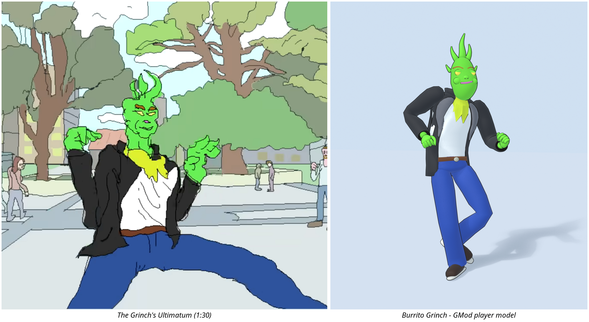

# Burrito Grinch (Ultimatum) player model

The dancing Grinch from PilotRedSun's *The Grinch's Ultimatum* (1:30): leather jacket,
white tee, yellow-green neck ruff, belt and jeans, as a Garry's Mod player model with
matching first-person hands.

- Player model: `models/player/burrito/grinch_ultimatum.mdl`, "Burrito Grinch (Ultimatum)"
  in the player model picker (`lua/autorun/burrito_grinch.lua`).
- Rig: the stock ValveBiped skeleton (bone for bone the citizen's), so every GMod
  animation, taunt and ragdoll works; ragdoll limits are the citizen's.
- Hands: `models/weapons/burrito/c_arms_grinch.mdl`.
- Look: flat colours with cartoon outlines (inverted hull), like the video.

## Rebuild

`tools/build.sh`: Blender 4.2 builds the mesh around `source/data/skeleton.json`
(read from GMod's male_07), writes SMD/QC, and GMod's studiomdl (Windows depot 4002,
under wine) compiles it. `python3 -m unittest discover tests` checks the files, the
skeleton, the materials and that every picker entry has its picture.

Fan work for personal use; the Grinch is Dr. Seuss Enterprises', the design is PilotRedSun's.
